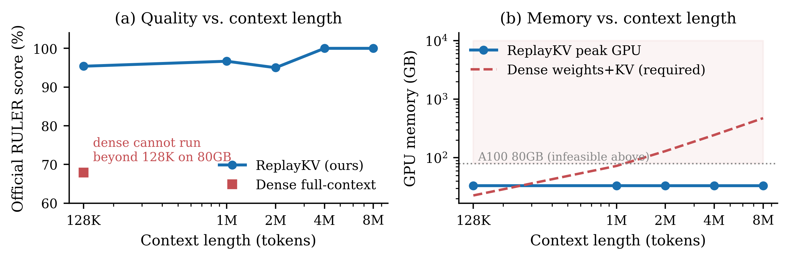

# ReplayKV

**Serve million-token contexts on a single GPU — by letting the engine index
its own token stream.**

ReplayKV is a bounded-replay serving architecture for evidence-shaped
long-context workloads. Context is indexed in one CPU pass (lexical
statistics + semantic tags from a 2.4 MB table distilled offline from an
embedding model); each query is answered from a ~1.2K-token replay selected
by typed operators. No neural network, vector store, or second model runs
in the serving path, and GPU memory is independent of context length.



## Headline results (official NVIDIA RULER, n=5/task)

| | Dense full-context | **ReplayKV** |
|---|---:|---:|
| Qwen2.5-7B @128K | 67.95 | **95.38** |
| Qwen2.5-14B @128K | 73.77 | **98.46** |
| Qwen2.5-32B @128K | 84.49 | **100.0** |
| Llama-3.1-8B @128K (held out) | 76.36 | **95.38** |
| Qwen2.5-7B @1M–8M | *cannot run* | **95.0–100.0 @ 33 GB flat** |

Eviction baselines (SnapKV, StreamingLLM) keeping 50× more tokens score
9–26 on the same data; a matched-budget BGE retrieval pipeline trails at
~100× the index cost. Full per-sample artifacts in `artifacts/`.

## Quickstart: any local model, zero config

```bash
pip install -e proxy/
ollama pull qwen2.5:7b
replaykv-proxy          # OpenAI-compatible proxy on :8800, or --takeover
```

Point any OpenAI client at `http://localhost:8800/v1` and paste a
million-token document into the system message. Works in front of Ollama,
llama.cpp server, LM Studio, or vLLM. See `proxy/README.md`.

## Reproduce the paper

- `bench/` — exact runners for every table (RULER product + dense baseline,
  KVPress, LongBench-v2 with all five ranking signals, known-evidence gate)
- `configs/frozen.json` — every hyperparameter, frozen before evaluation
- `tables/` — distilled tag tables (Qwen2.5, Llama 3.x); rebuild with
  `python -m replaykv.learned_tags --source distilled --k 1024 --model <hf-id>`
- `artifacts/` — summary + per-sample records for all reported runs

Paper: *ReplayKV: Bounded-Replay Long-Context Serving with a Self-Built
Index* (arXiv link forthcoming; under review at TMLR).

## License

Apache 2.0.
